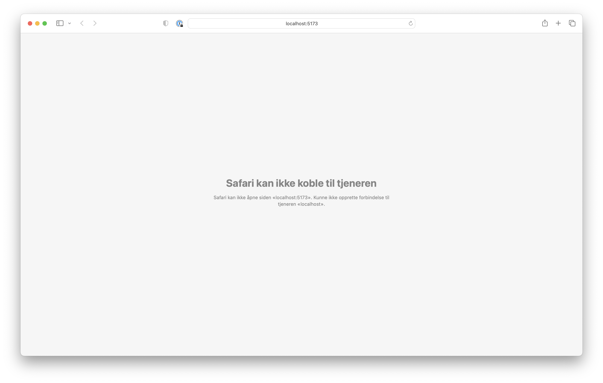

# Lese inn store JSON-filer i SvelteKit

Denne kodebasen viser hvordan man kan lese inn <em>veldig</em> store JSON-filer i en [SvelteKit](https://kit.svelte.dev/)-kodebase uten at byggeprosessen krasjer.
Nederst i dokumentet finner du noen tips for at datamaskinen skal jobbe raskere mens du jobber med store datafiler.

Vi har laget kodebasen for å hjelpe de som bruker [læreverket Kode](https://kode.cappelendamm.no) med å løse [eksamensoppgaveeksempelet for IT2 våren 2023 (passordbeskyttet)](https://kandidat.udir.no/epsmateriell/eksempeloppgave?navn=rea3049-div+informasjonsteknologi+2&fagkode=rea3049-div&malform=nb-no).
Løsningene vil sannsynligvis også være nyttige i andre sammenhenger.

<i>Filen `src/routes/05.json` er hentet fra [Oslo bysykkels åpne data](https://oslobysykkel.no/apne-data). Disse dataene er gjort tilgjengelig under [Norsk lisens for offentlige data (NLOD) 2.0](https://data.norge.no/nlod/no/2.0) av [UIP Oslo bysykkel AS](https://oslobysykkel.no/om).</i>

- [Hvordan bruke denne kodebasen](#hvordan-bruke-denne-kodebasen)
  - [Installere avhengigheter](#installere-avhengigheter)
  - [Starte utviklingstjeneren](#starte-utviklingstjeneren)
  - [Bygge appen](#bygge-appen)
- [Forklaring av problem og løsning](#forklaring-av-problem-og-løsning)
  - [Problemet: Byggeprosessen går tom for minne](#problemet-byggeprosessen-går-tom-for-minne)
  - [Løsningen: Gi prosessen mer minne](#løsningen-gi-prosessen-mer-minne)
    - [Eksempel på hvordan vi brukte denne oppskriften](#eksempel-på-hvordan-vi-brukte-denne-oppskriften)
      - [Scriptene i `package.json` etter alle endringer](#scriptene-i-packagejson-etter-alle-endringer)
    - [Hvis algoritmen ikke virker, må man kutte ut unødvendige felter fra JSON-fila](#hvis-algoritmen-ikke-virker-må-man-kutte-ut-unødvendige-felter-fra-json-fila)
- [Tips for å få ting til å gå raskere](#tips-for-å-få-ting-til-å-gå-raskere)
  - [Kutt ned på dataen mens du utvikler](#kutt-ned-på-dataen-mens-du-utvikler)
  - [Bytt ut `.map` og `.reduce` med `for … of`-løkker](#bytt-ut-map-og-reduce-med-for--of-løkker)

## Hvordan bruke denne kodebasen

### Installere avhengigheter

```bash
npm install
```

### Starte utviklingstjeneren

```bash
npm run dev
```

### Bygge appen

```bash
npm run build
```

Du kan forhåndsvise den bygde appen med `npm run preview`.

## Forklaring av problem og løsning

### Problemet: Byggeprosessen går tom for minne

I oppgave 12 fra oppgavesettet blir kandidaten bedt om å lese inn et datasett på 80 MB fra Oslo
bysykkel.

> <strong>Oppgave 12 – Oversikt over sykkelturer</strong>
>
> Du skal lage et program som leser inn informasjon fra datasettet og presenterer dette i to
> oversikter. Du skal bruke datasettet fra forberedelsen. Hvis du ikke har forberedt dette kan du
> også laste ned datasettet fra forberedelsesdelen nå.
>
> a) Lag et program som presenterer de tre mest brukte startlokasjonene og de tre minst brukte
> startlokasjonene. Presentasjonen skal også vise antall turer fra disse startlokasjonene.
>
> b) Utvid programmet slik at det også presenter et passende diagram som viser totalt antall turer
> fra alle startlokasjoner til sammen, per ukedag.

Et ganske naturlig sted å starte er å lage en fil der man importerer datasettet, for eksempel:

```sveltehtml
<!-- src/routes/+page.svelte -->
<script>
	import sykkeldata from './05.json';
</script>

<h1>Hello World</h1>
<p>Her kommer det en løsning etter hvert</p>
```

Når man starter utviklingstjeneren med `npm run dev -- --open`, går ting galt. Først venter man <em>lenge</em> på at siden skal laste inn, men så mister nettleseren tilkoblingen til utviklingstjeneren.



Hvis man undersøker vinduet der man startet utviklingstjeneren, vil man se at utviklingstjeneren har krasjet. Feilmeldingen der skal starte med `<--- Last few GCs --->`.

Under overskriften `<--- JS stacktrace --->` står det hva feilen faktisk skyldes: `FATAL ERROR: Reached heap limit Allocation failed - JavaScript heap out of memory`.
<strong>Denne feilmeldingen betyr at SvelteKit har brukt opp minnet den fikk til å kjøre Svelte.</strong>

```
<--- Last few GCs --->

[25901:0x7f7a08040000] 39936 ms: Mark-sweep 4057.1 (4138.9) -> 4055.9 (4138.9) MB, 2334.3 / 0.0 ms
(average mu = 0.158, current mu = 0.035) allocation failure; scavenge might not succeed
[25901:0x7f7a08040000] 43614 ms: Mark-sweep 4071.6 (4138.9) -> 4070.5 (4169.4) MB, 3668.5 / 0.0 ms
(average mu = 0.074, current mu = 0.003) allocation failure; scavenge might not succeed

<--- JS stacktrace --->

FATAL ERROR: Reached heap limit Allocation failed - JavaScript heap out of memory 1: 0x108bc0dc5
node::Abort() (.cold.1) [/Users/foo/.asdf/installs/nodejs/18.14.1/bin/node] 2: 0x1076441e9
node::Abort() [/Users/foo/.asdf/installs/nodejs/18.14.1/bin/node] 3: 0x1076443ce
node::OOMErrorHandler(char const*, bool) [/Users/foo/.asdf/installs/nodejs/18.14.1/bin/node] 4:
0x1077d0f63 v8::internal::V8::FatalProcessOutOfMemory(v8::internal::Isolate*, char const*, bool)

(… og så videre)
```

Kommandoen `dev` i SvelteKit benytter seg av byggeverktøyet Vite.
Feilen som oppstår i dette prosjektet, ligner på [en kjent svakhet i Vite](https://github.com/vitejs/vite/issues/2433#issuecomment-792914871).
Heldigvis finnes det en mulig løsning på problemet, som er øverste kommentar på saken: Gi prosessen mer minne.

### Løsningen: Gi prosessen mer minne

Man kan gi et script i et SvelteKit-prosjekt mer minne ved å sette en miljøvariabel som heter `NODE_OPTIONS`.
For å være så å si garantert å lykkes, kan man følge følgende oppskrift
(eller <em>algoritme</em>, for å bruke fagspråket):

1. Installer pakken [`cross-env`](https://www.npmjs.com/package/cross-env) med `npm install --save-dev cross-env`.
2. Åpne fila `package.json` i prosjektet ditt og finn fram til nøkkelen `scripts`.
3. Skriv `cross-env NODE_OPTIONS=--max_old_space_size=8192` foran den kommandoen som krasjer.
   Dette betyr at kommandoen skal ha 8 GB minne (i stedet for de vanlige 4 GB den får av Node.js som standard).
4. Prøv å kjøre kommandoen på nytt.
   1. Hvis kommandoen fortsatt krasjer, dobler du tallet etter `--max_old_space_size=` (for eksempel `--max_old_space_size=16384`) og prøver enda en gang.
   2. Hvis kommandoen <em>ikke</em> krasjer, er du ferdig!

#### Eksempel på hvordan vi brukte denne oppskriften

Først installerte vi `cross-env`.

Kommandoen som krasjet i det tidligere eksempelet var `dev`.
Derfor endret vi `package.json` slik:

```
"dev": "cross-env NODE_OPTIONS=--max_old_space_size=8196 vite dev",
```

Når vi kjørte `npm run dev -- --open`, krasjet appen dessverre fortsatt.
Vi doblet derfor tallet etter `--max_old_space_size=`.
Etterpå så kommandoen slik ut i `package.json`:

```
"dev": "cross-env NODE_OPTIONS=--max_old_space_size=16384 vite dev",
```

Da kjørte appen fint!

##### Scriptene i `package.json` etter alle endringer

I tillegg til scriptet `dev`, var også scriptet `build` trøblete.
Etter å ha brukt fremgangsmåten over også på kommandoen `build`, så scriptene de slik ut:

```
"dev": "NODE_OPTIONS=--max_old_space_size=16384 vite dev",
"build": "NODE_OPTIONS=--max_old_space_size=16384 vite build",
"dev:original": "vite dev",
"build:original": "vite build",
```

Vi har beholdt de originale kommandoene som `dev:original` og `build:original` fordi vi har ønsket å kunne undersøke krasjene bedre.

#### Hvis algoritmen ikke virker, må man kutte ut unødvendige felter fra JSON-fila

Man kan sette ganske høye verdier bak `--max_old_space_size=`.
Verdien kan fint være høyere enn mengden internminne (RAM) man har på datamaskinen sin, for om man bruker mer plass enn det finnes i internminnet, vil operativsystemet begynne å skrive til harddisken i stedet.
Men etter hvert vil man også bli begrenset av størrelsen på harddisken.
Da er problemet man prøver å løse for stort for SvelteKit.

I slike tilfeller blir man rett og slett nødt til å kutte ned på mengden data i JSON-fila før du laster den inn i SvelteKit.
For eksempel kan du fjerne felter som du ikke bruker i appen.
Dessverre er dette temaet for omfattende til at det er mulig å omtale her.
Heldigvis er vi ganske sikre på at alle filer som trengs på eksamener i IT2 kommer til å være små nok til at det vil virke å bruke `--max_old_space_size=`.

## Tips for å få ting til å gå raskere

### Kutt ned på dataen mens du utvikler

Hvis du har en stor JSON-fil med data, kan det være lurt å lage et mindre datasett som du bruker mens du utvikler.
Lag for eksempel en ny JSON-fil som inneholder bare de første 1000 elementene i den store fila.
<strong>Husk å bytte tilbake til det fullstendige datasettet før du eventuelt leverer.</strong>

### Bytt ut `.map` og `.reduce` med `for … of`-løkker

Selv om `.map` og `.reduce` er nyttige funksjoner, kan de være ganske mye tregere enn vanlige løkker (se [The reduce (`{...spread}`) anti-pattern](https://www.richsnapp.com/article/2019/06-09-reduce-spread-anti-pattern)).

Vi opplevde at koden i dette prosjektet ble <em>mye</em> raskere når vi byttet ut `.map` og `.reduce` med vanlige løkker.

For eksempel:

```js
// Dette er raskt:
$: turerPerStasjon = regnUtTurerPerStasjon(sykkeldata);
function regnUtTurerPerStasjon(data) {
	let teller = {};
	for (const tur of data) {
		const turtall = teller[tur.start_station_name];
		teller[tur.start_station_name] = (turtall || 0) + 1;
	}
	return teller;
}

// Dette er tregt:
$: turerPerStasjon = sykkeldata.reduce((acc, stasjon) => {
	const turtall = (acc[stasjon.start_station_name] || 0) + 1;
	return { ...acc, [stasjon.start_station_name]: turtall };
}, {});
```
